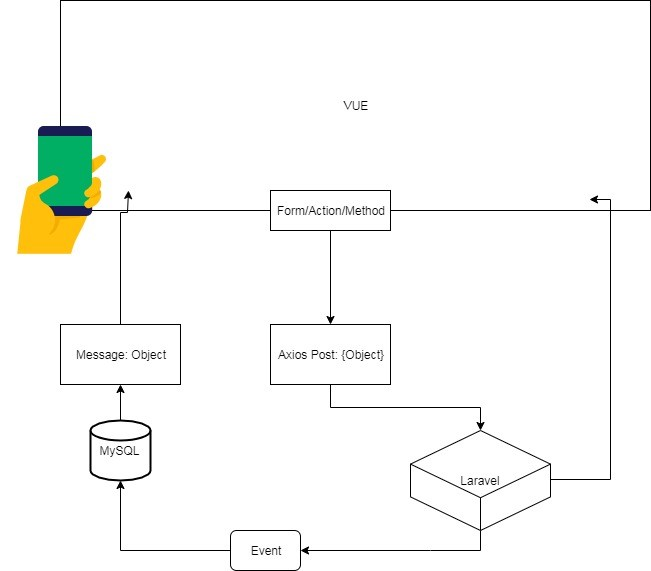

## Sistema Inteligente de Recomendación de Productos   
*Documento de Diseño* 
**Versión 1.0**

## Historial de Revisiones
| Fecha      | Versión | Descripción                                       | Elaborado por          |
| ---        | ---     | ---                                               | ---                    |
| 12/10/2019 | 1.0     | Creación del documento de diseño                  | Gonzalo Rojas Espinoza |
| 07/11/2019 | 1.1     | Inserción de contenido y diagrama de arquitectura | Gonzalo Rojas Espinoza |

## Tabla de Contenido
1.   INTRODUCCIÓN 
    1.1 Alcance 
    1.2 Objetivos
2.   DEFINICIÓN DE LA ARQUITECTURA DEL SISTEMA
    2.1 Definición de Niveles de Arquitectura del Sistema 

# 1. INTRODUCCIÓN
El presente documento, documento de diseño del sistema, revela todo lo concerniente al diseño (en alto nivel) del Sistema Inteligente para la Recomendación de Productos (SIRP). Aquí documentaremos la arquitectura del sistema, el modelo de datos y diseño de clases respectivas. 

## 1.1 Alcance
Realizar un sistema inteligente de recomendación de productos, el cual funcionará durante el proceso de compra en tiendas de conveniencia, para así incrementar el volumen de venta de productos afines, así como permitir conocer mejor el hábito del público objetivo y mejorar el proceso de abastecimiento del negocio.

## 1.2 Objetivos
Los objetivos principales de este documento se enumeran a continuación:
•   Presentar el modelo de datos definido
•   Conocer el diseño de la arquitectura que posee el SIRP
•   Conocer los diagramas de clases del sistema

# 2. EL SISTEMA
El SIRP es un sistema web, el cual podrá ser utilizado desde una plataforma de escritorio, como también de un móvil. Utiliza una base de datos MySQL y además el framework Laravel como parte del backend. En cuanto al frontend de la aplicación, utilizamos el framework progresivo Vue.js.

## 2.1 Definición de Niveles de Arquitectura del Sistema
•   Nivel cliente: En esta capa estará desplegada nuestra aplicación. Elegimos Vue.js ya que es un framework ligero (pero con buena performance y potencia) el cual nos permite crear SPAs, y se integra fácilmente con tecnologías ya existentes. Además, es compatible con Laravel, lo cual especificaremos más adelante.

•   Nivel servidor: Esta capa estará albergada en la nube y se encargará de procesar las peticiones con Laravel. Además, allí se encontrará nuestra base de datos en MySQL, donde se almacenarán los datos que servirán de input para nuestro sistema inteligente y así poder ofrecer recomendaciones acertadas a nuestros clientes. 

# 3. MODELO FÍSICO DE DATOS
El SIRP usará MySQL como gestor de base de datos. Nuestro equipo ya cuenta con mucha experiencia trabajando con este gestor, lo cual sumado a la ya garantizada seguridad que ofrece y su alta compatiblidad con muchas tecnologías, lo hizo el gestor ideal para nuestro proyecto. Por el momento, nuestras tablas están normalizadas, para así evitar redundancias. Sin embargo, si más adelante es necesario incrementar el performance en ciertas consultas, una desnormalización podría ser considerada.

